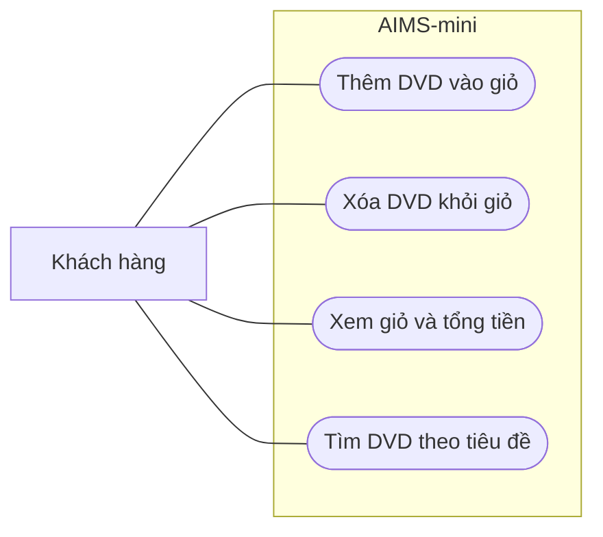

# Use case AIMS-mini

```mermaid
flowchart LR
    customer["Khách hàng"]
    subgraph aims["AIMS-mini"]
        add([Thêm DVD vào giỏ])
        remove([Xóa DVD khỏi giỏ])
        view([Xem giỏ và tổng tiền])
        search([Tìm DVD theo tiêu đề])
    end
    customer --- add
    customer --- remove
    customer --- view
    customer --- search
```

Giỏ hàng có giới hạn 20 DVD.
